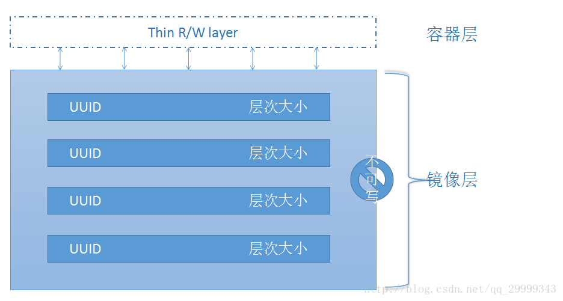

# Docker 基础学习笔记

## 目录

* **[Docker 常用命令](#docker-常用命令-top)**
* **[Docker 基础架构](#docker-基础架构-top)**
* **[Docker 原理简述](#docker-原理简述-top)**
* **[Dockerfile - 构建产生镜像](#dockerfile---构建产生镜像-top)**
* **[Docker Compose - 编排操控容器](#docker-compose---编排操控容器-top)**
* **[Docker Machine - 创建管理容器宿主机](#docker-machine---创建管理容器宿主机-top)**
* **[Docker Swarm](#docker-swarm-top)**


## Docker 常用命令 [[Top]](#目录)

* <kbd>docker search 关键字</kbd> - 默认从 docker hub 搜索指定镜像
* <kbd>docker pull 镜像名:tag</kbd> - 拉取镜像
* <kbd>docker images</kbd> - 列出已安装的镜像
* <kbd>docker rmi image-id</kbd> - 删除指定镜像
* <kbd>docker rm container-id</kbd> - 删除指定容器
* <kbd>docker ps</kbd> -  查看运行中的容器 `-a` 查看所有容器
* <kbd>docker start|stop container-id|container-name</kbd> - 通过容器 id 或容器名运行 / 关闭容器
* <kbd>docker run --name 容器名 -d -p 3306:3306 mysql</kbd>  - docker 启动容器
  * `--name` - 自定义容器名
  * `-p` - 端口映射，`-p 宿主机端口:容器端口`
  * `-d` - 守护进程
*  docker logs container-name/container-id 查看容器日志
* Ctrl+P+Q 退出容器交互式界面，但不关闭容器
* docker help - 检查最新 Docker 可用命令
* docker attach—将本地输入、输出、错误流附加到正在运行的容器
* docker commit—从当前更改的容器状态创建新镜像
* docker exec—在活动或正在运行的容器中运行命令
* docker exec -it container command
* docker history [img]—显示镜像历史记录
* docker info—显示系统范围信息
* docker inspect [img|con]—查找 docker 指定容器和镜像的系统级信息
* docker login --username=xxx --email=xxx - 登录到本地注册表或 Docker Hub
* docker pull—从本地注册表或 Docker Hub 中提取镜像或存储库
* docker ps—列出容器的各种属性
* docker start/stop/restart—启动/关闭/重启容器
* docker rm—移除容器
* docker rmi—删除镜像
* docker run—在隔离容器中运行命令
* docker search—在 Docker Hub 中搜索镜像
* docker version—显示 docker 版本信息

<kbd>**docker run volume**</kbd> - 数据卷、数据卷容器

* <kbd>**docker run -v|--volume[=[[HOST-DIR:]CONTAINER-DIR[:OPTIONS]]] ...**</kbd> - 添加一个数据卷
* <kbd>**docker inspect --format="{{ .Volumes }}" [container]**</kbd> - 查看宿主机上对应容器数据卷位置
* <kbd>**docker run -it -v /dbdata --name dbdata ubuntu**</kbd> - 创建一个数据卷容器 dbdata ，并在其中创建一个数据卷挂载到 /dbdata
* <kbd>**docker run -it --volumes-from dbdata --name db1 ubuntu**</kbd> - 创建 db1 容器，并从 dbdata 容器挂载数据卷
* <kbd>**docker rm -v**</kbd> - 删除容器和容器绑定的数据卷
* <kbd>**docker run --rm**</kbd> - 在关闭容器后也会自动删除容器和容器绑定的数据卷
* <kbd>****</kbd> - 

<kbd>**docker network**</kbd> - 管理网络

* docker network ls
* docker network connect
* docker network create
* docker network disconnect
* docker network inspect
* docker network prune
* docker network rm


## Docker 基础架构 [[Top]](#目录)

* C/S 架构 - 客户端、服务器两大组件
* 客户端可以通过 **socket** 或 **RESTful API** 与服务器进行通信
* 常说的 Docker 也可称为 Docker Engine
* <kbd>**Docker Engine**</kbd> = <kbd>**Docker 守护进程**</kbd> + <kbd>**REST API （指定与守护进程交互的接口）**</kbd> + <kbd>**命令行接口（CLI）（与守护进程通信，通过封装 REST API）**</kbd>


### 服务端

#### 一、四大组件

1. <kbd>**dockerd**</kbd>

``` bash
$ ps -ef | grep dockerd
root      3769     1  0 Dec02 ?        00:01:08 /usr/bin/dockerd -H fd:// --containerd=/run/containerd/containerd.sock
```

1. <kbd>**docker-proxy**</kbd>

dockerd 子进程，当容器启动并使用端口映射时才会执行，负责配置容器的端口映射规则

```bash
$ ps aux | grep docker-proxy
root     24923  0.0  0.0 700716  4656 ?        Sl   13:19   0:00 /usr/bin/docker-proxy -proto tcp -host-ip 0.0.0.0 -host-port 8011 -container-ip 172.17.0.2 -container-port 80
root     24937  0.0  0.0 626728  3824 ?        Sl   13:19   0:00 /usr/bin/docker-proxy -proto tcp -host-ip 0.0.0.0 -host-port 2222 -container-ip 172.17.0.2 -container-port 2222
```

3. <kbd>**containerd**</kbd>

dockerd 子进程


4. <kbd>**containerd-shim**</kbd>

containerd 子进程

### 客户端


## Docker 原理简述 [[Top]](#目录)

### 命名空间 - namespace

* 操作系统中，进程间共享的资源有内核、文件系统、网络、进程号 ( Process ID, PID )、用户号 ( User ID，UID )、进程间通信 ( InterProcess Communication，IPC )等。Linux 命名空间就是为了实现以上的相互隔离，保证了容器之间彼此互补影响


1. <kbd>**进程命名空间**</kbd>


2. <kbd>**IPC 命名空间**</kbd>

* IPC - Interprocess Communication - 进程间交互
* 容器中的进程交互还是采用 Linux 常见 IPC，包括信号量、消息队列、共享内存等方式


3. <kbd>**网络命名空间**</kbd>


4. <kbd>**挂载命名空间**</kbd>


5. <kbd>**UTS 命名空间**</kbd>

* UTS - UNIX Time-sharing System
* 


6. <kbd>**用户命名空间**</kbd>


### 控制组 - Control Groups - CGroups

* Linux 内核特性，主要用来对共享资源进行隔离、限制、审计等


### 联合文件系统 - Union File System - UnionFS




1. 容器就是由存储 image 的只读层和读写层构成

2. 容器需要修改只读层的文件，会先从只读层拷贝一份到读写层，再修改它，实际上修改的是副本。但修改后，只读层对应的文件就“隐藏” 起来了

3. 容器的只读层是共享的，也就是当同一镜像创建的多个容器时，其实只是创建了多个读写层，删除容器时，就只是删除容器的读写层。而且读写层也是在容器操作产生数据时才消耗资源，所以创建容器的成本很小！
4. docker engine 是共享宿主机操作系统的，容器又是共享 image 的（只读层共享），所以容器启动成本很小！

## Dockerfile - 构建产生镜像 [[Top]](#目录)


## Docker Compose - 编排操控容器 [[Top]](#目录)

1. 编写需要重复生成应用 ( app ) 的 **Dockerfile**

> 一般一个容器里一个应用，比如 mysql 数据库

2. 定义用于编排多个应用以组成服务 ( service ) 的 **docker-compose.yml** 

> 一个服务一般由多个应用组成，比如 web service 可以由 nignx 负载均衡器、tomcat web 服务器、mysql 数据库服务器等组成

3.  `docker-compose up`

* docker-compose 本身没有构建镜像的功能，如果容器镜像是直接从 docker registry 拉取，则不需要 Dockerfile ；但如果需要基于基础镜像构建新的镜像，则需要使用 Dockerfile


## Docker Machine - 创建管理容器宿主机 [[Top]](#目录)

<kbd>**简介**</kbd>

* docker-machine 可以在本地、云端服务器快速创建包含 Docker Engine 的虚拟主机环境，但不能在虚拟机中创建（虚拟机中不能再创建虚拟机）
* docker-machine 可以启动、审查、停止和重新启动托管的宿主机、升级 Docker 客户端和守护程序、并配置 Docker 客户端与你的宿主机通信
* 也可以使用 Ansible 等 DevOps 工具实现对 Docker 环境的自动化管理

* 本质上 docker-machine 是一个虚拟机管理工具，它通过创建一个安装好docker 的虚拟机（支持 VirtualBox，DigitalOcean，EC2 等），并设置对应的环境变量（ DOCKER_HOST，DOCKER_MACHINE_NAME 等），使得本地的 docker 工具获得透明远程操作虚拟机的能力。从而使本身不支持 docker 的 Windows 和 Mac 系统能够直接使用 docker 命令

<kbd>**安装**</kbd>

> https://github.com/docker/machine/releases/

```bash
$ curl -L https://github.com/docker/machine/releases/download/v0.16.2/docker-machine-`uname -s`-`uname -m` >/usr/local/bin/docker-machine
$ chmod +x /usr/local/bin/docker-machine
```

<kbd>**常用命令**</kbd>

* <kbd>**docker-machine [OPTIONS] COMMAND [arg...]**</kbd>

* <kbd>docker-machine -h</kbd> - 查看常用命令
* <kbd>docker-machine COMMAND -h</kbd> - 查看具体某一个命令功能

<kbd>**解决首次运行慢**</kbd>

> 第一次运行 `docker-machine create` 会去 https://github.com/boot2docker/boot2docker/releases/ 下载一个最新的 57M 的 boot2docker.iso 镜像，国内下载会很慢

``` bash
# 1. 下载 boot2docker.iso  最新版本到本地 - https://github.com/boot2docker/boot2docker/releases/
# 2. 移动 boot2docker.iso  到 ~/.docker/machine/cache/
$ mv boot2docker.iso ~/.docker/machine/cache/
# 3. 指定本地的 boot2docker.iso 路径，并跳过网络检查创建新的 docker machine ，命名为 default
$ docker-machine create default -d virutalbox --virtualbox-boot2docker-url=/home/`whoami`/.docker/machine/cache/boot2docker.iso 
# --virtualbox-boot2docker-url  手动指定了boot2docker.iso 位置
```

<kbd>**配置当前shell docker server**</kbd>

```bash
$ docker-machine env default
export DOCKER_TLS_VERIFY="1"
export DOCKER_HOST="tcp://192.168.99.100:2376"
export DOCKER_CERT_PATH="/home/xcq/.docker/machine/machines/default"
export DOCKER_MACHINE_NAME="default"
# Run this command to configure your shell: 
# eval $(docker-machine env default)
$ eval $(docker-machine env default)
# 执行上面命令即可切换 docker server 为 default 主机中 docker server
```


## Docker Swarm [[Top]](#目录)

