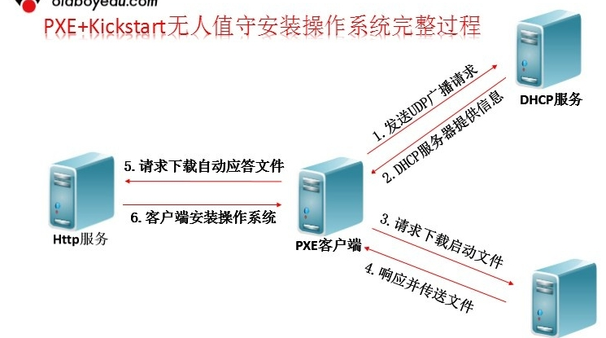
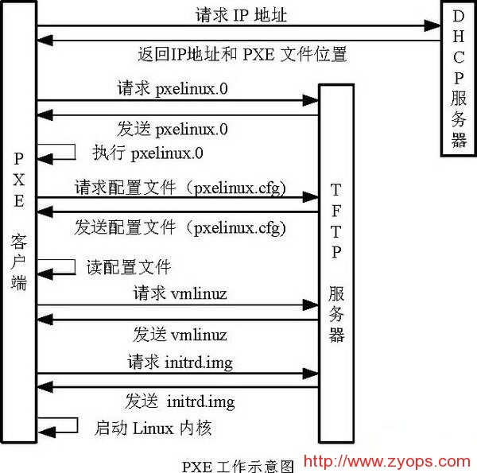

# Cobbler 学习

* Cobbler 是通过将 DHCP、TFTP、DNS、HTTP 等服务进行集成，创建一个中央管理节点，其可以实现的功能有配置服务，创建存储库，解压缩操作系统媒介，代理或集成一个配置管理系统，控制电源管理等
* Cobbler 的最终目的是实现无需进行人工干预即可安装机器
* Cobbler 由 python 语言开发，是对 PXE 和 Kickstart 以及 DHCP 的封装。融合很多特性，提供了 CLI 和 Web 的管理形式。更加方便的实行网络安装。同时，Cobbler 也提供了 API 接口，使用其它语言也很容易做扩展。它不紧可以安装物理机，同时也支持 kvm、xen 虚拟化、Guest OS 的安装。更多的是它还能结合 Puppet 等集中化管理软件，实现自动化的管理。

## PXE

* PXE - Preboot Execution Environment - 预启动执行环境、预执行环境
* 通过网络接口启动计算机，不依赖本地存储设备（如硬盘）或本地已安装的操作系统
* 由 Intel 和 Systemsoft 公司于 1999 年 9 月 20 日公布的技术
* Client/Server 的工作模式
* PXE 客户端会调用网际协议 ( IP )、用户数据报协议 ( UDP )、动态主机设定协议 ( DHCP )、小型文件传输协议 ( TFTP ) 等网络协议；
* PXE客户端 ( client ) 这个术语是指机器在 PXE 启动过程中的角色。一个 PXE客户端可以是一台服务器、笔记本电脑或者其他装有 PXE 启动代码的机器（我们电脑的网卡）

1. PXE Client向DHCP发送请求 PXE Client从自己的PXE网卡启动，通过PXE BootROM(自启动芯片)会以UDP(简单用户数据报协议)发送一个广播请求，向本网络中的DHCP服务器索取IP。

2. DHCP服务器提供信息 DHCP服务器收到客户端的请求，验证是否来至合法的PXE Client的请求，验证通过它将给客户端一个“提供”响应，这个“提供”响应中包含了为客户端分配的IP地址、pxelinux启动程序(TFTP)位置，以及配置文件所在位置。

3. PXE客户端请求下载启动文件 客户端收到服务器的“回应”后，会回应一个帧，以请求传送启动所需文件。这些启动文件包括：pxelinux.0、pxelinux.cfg/default、vmlinuz、initrd.img等文件。

4. Boot Server响应客户端请求并传送文件 当服务器收到客户端的请求后，他们之间之后将有更多的信息在客户端与服务器之间作应答, 用以决定启动参数。BootROM由TFTP通讯协议从Boot Server下载启动安装程序所必须的文件(pxelinux.0、pxelinux.cfg/default)。default文件下载完成后，会根据该文件中定义的引导顺序，启动Linux安装程序的引导内核。

5. 请求下载自动应答文件 客户端通过pxelinux.cfg/default文件成功的引导Linux安装内核后，安装程序首先必须确定你通过什么安装介质来安装linux，如果是通过网络安装(NFS, FTP, HTTP)，则会在这个时候初始化网络，并定位安装源位置。接着会读取default文件中指定的自动应答文件ks.cfg所在位置，根据该位置请求下载该文件。

## kickstart

* Kickstart 是红帽搞出来的一个东西，我们可以简单理解为一个自动安装应答配置管理程序。通过读取这个配置文件，系统知道怎么去分区，要安装什么包，配什么IP，优化什么内核参数等等。其主要有以下部分组成：
* Kickstart 安装选项，包含语言的选择，防火墙，密码，网络，分区的设置等；
* %Pre 部分，安装前解析的脚本，通常用来生成特殊的ks配置，比如由一段程序决定磁盘分区等；
* %Package 部分，安装包的选择，可以是 @core 这样的group的形式，也可以是这样 vim-* 包的形式；
* %Post 部分，安装后执行的脚本，通常用来做系统的初始化设置。比如启动的服务，相关的设定等。
